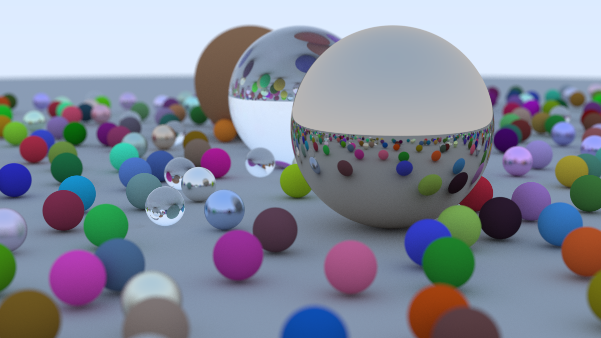

# Ray Tracing in One Weekend

This is a Rust implementation of Peter Shirley's "[_Ray Tracing in One Weekend_](https://raytracing.github.io/books/RayTracingInOneWeekend.html)" tutorial series for learning purpose.

## Building and Running

Ensure you have the Rust toolchain installed, then execute:

`cargo run --release > image.ppm`

You should see something akin to the below image after the render has finished.

